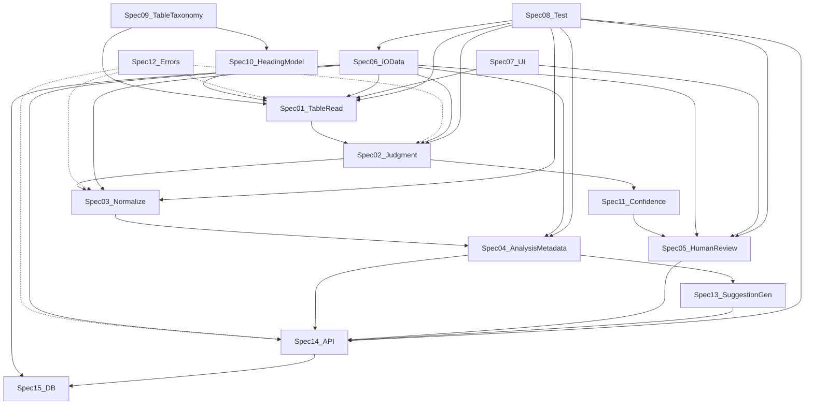
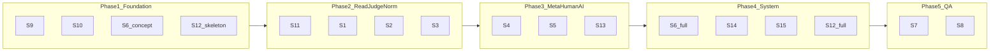

# 仕様書群設計計画（15本・表読取／分析提案AI）

本書は、表読取・分析提案AI向けの高優先仕様書15本について、責務・依存・作成順・配置・章立て・具体定義範囲・命名規則・優先度・レビュー観点を整理した **設計計画** である。本文の詳細執筆は各 `SPEC-TI-*` に委ねる。

---

## 1. 全体方針サマリ

- **正本は `AIdocs/` 配下の Markdown**。既存の `AIdocs/systems/`・`AIdocs/verification/` 等と並列に、**「表インテリジェンス（仮称）」用の専用ツリー** `AIdocs/specs/table-intelligence/` を新設し、Phase2 既存仕様（例: `systems/profiling-spec.md`）とは **参照リンクで接続**する（重複定義を避ける）。
- **意味構造ファースト**: セル配列ではなく、見出し階層・軸・指標・単位・集計行・注記を一次オブジェクトとして扱う。これが **表分類体系** と **見出しモデル** を最上流に置く理由。
- **精度不足は人確認へ自然遷移**: 判定・スコアリング・UI・API が同じ **状態機械と閾値** を参照する（ドリフト防止）。
- **ITリテラシー低め利用者**: 人確認フロー仕様と UI 仕様に **用語辞書・画面ごとの言い換え・最小ステップ** を明記し、判定ロジック側は内部用語と利用者向け用語を分離する。
- **実装接続**: 入出力データ仕様が **API／DB／ジョブ** の契約の束ね役。OpenAPI／ERD は API／DB 仕様の成果物として位置づける。

---

## 2. 15本の仕様書一覧（1〜2行要約）

1. **表読取仕様書**: ファイルから表候補・セル属性・結合・原本方針までを機械可読に抽出する規約。
2. **判定ロジック仕様書**: 表種別・行種別・列意味・自動確定可否をルールと証跡で定義。
3. **変換・正規化仕様書**: 内部正規表現（縦持ち等）への写像とトレーサビリティ。
4. **分析メタデータ仕様書**: dimensions/measures/grain 等、分析エンジンと候補生成への入力契約。
5. **人確認フロー仕様書**: 遷移条件・質問・回答形式・再判定・利用者配慮のプロセス仕様。
6. **入出力データ仕様書**: 全ステージのデータ契約（スキーマ名・必須項目・版）の単一参照源。
7. **UI仕様書**: 画面フロー・コンポーネント・文言・エラー表示・導線の利用者向け仕様。
8. **テスト仕様書**: 表種別ごとの期待挙動・回帰・精度指標・API/UI の検証マトリクス。
9. **表分類体系仕様書**: 表タイプの定義語彙と後続処理の分岐表（タクソノミー）。
10. **見出しモデル仕様書**: 行／列／多段見出し・継承・欠落時の意味付けルール。
11. **信頼度スコアリング仕様書**: スコア要素・閾値・ログ・UI 表示の一貫した定義。
12. **エラー処理・例外仕様書**: 失敗モード分類・再試行・利用者文言・運用ログの横断規約。
13. **分析候補生成仕様書**: メタデータから候補を生成／抑制するルールと根拠表現。
14. **API仕様書**: 同期／非同期・ステータス・認可・エラー形式と入出力データとの対応。
15. **DB設計仕様書**: 永続化エンティティ・履歴・ジョブ・監査と再処理の整合。

---

## 3. 依存関係（要点）

- **最上流（他の前提）**: 9 表分類体系 → 10 見出しモデル →（並行）6 入出力の **概念データ辞書**。
- **コアパイプライン**: 1 表読取 → 2 判定 → 3 変換・正規化 → 4 分析メタデータ。
- **ゲーティング**: 11 信頼度 が 2 判定・5 人確認・7 UI に横断的に効く。
- **提案**: 13 分析候補生成 は 4 に強く依存。12 エラーは全レイヤで参照される **横断仕様**（ただし詳細は Phase 4 で固定）。
- **システム面**: 6 が 14 API・15 DB の **フィールド名・列挙値・状態遷移の正本**。8 テストは 6 のフィクスチャと期待 JSON を正とする。



---

## 4. 推奨作成順（Phase 定義）

### Phase 1: 土台設計（語彙とデータの骨格）

**含める仕様書**: 9 → 10 → 6（概念版）→ 12（骨格版）

**理由**: 表の「意味構造」と「データ契約の語彙」が無いと、読取・判定・変換の文章が毎回再定義になる。エラーは早期にコード空間を確保し後戻りコストを下げる。

**完了条件**

- 表タイプ列挙と定義がレビュー可能な粒度で固定（追加は版上げルール付き）。
- 見出しモデルの UML 的説明（行／列／階層・継承）が図示可能。
- 6 に **エンティティ10前後** のドラフトが載る。
- 12 に **エラーコード命名規則** とカテゴリ（利用者／運用／開発）が載る。

### Phase 2: 判定・変換設計（コアアルゴリズム契約）

**含める仕様書**: 11（閾値はドラフト→確定）→ 1 → 2 → 3

**完了条件**

- 1〜3 が **6 のスキーマ断片**（JSON 例付き）を参照して書ける。
- 2 と 11 の **同じ用語**で「自動確定／要確認／不可」の遷移が記述されている。
- 3 に **トレーサビリティ**（cell_ref / source_range）方針が明文化されている。

### Phase 3: AI提案・人確認設計

**含める仕様書**: 4 → 5 → 13

**完了条件**

- 4 が dimensions/measures/grain/time の **必須・任意・禁止組合せ** を持つ。
- 5 が **画面ステップと API の対応**まで書ける。
- 13 が「出さない候補」の否定条件を持つ。

### Phase 4: システム接続設計

**含める仕様書**: 6（完全版）→ 14 → 15 → 12（完全版）

**完了条件**

- 14 の各エンドポイントが 6 の **どの DTO を入出力するか** が一覧化されている。
- 15 の各テーブルが 6 の **どのオブジェクトを永続化するか** が一覧化されている。
- 12 の各エラーが **HTTP ステータス／ジョブ失敗／UI メッセージ** にマッピングされている。

### Phase 5: UI・テスト・品質保証

**含める仕様書**: 7 → 8

**完了条件**

- 7 に **利用者向け用語辞書**がある。
- 8 に **表種別×工程のテストマトリクス** と精度 KPI の定義がある。



---

## 5. `AIdocs/` 推奨フォルダ構成

実体は `AIdocs/specs/table-intelligence/` 以下に配置する。同一番号の仕様は **ファイル1本**とし、Phase が進むごとに同一ファイル内でセクションを厚くする（ファイル重複を避ける）。

```text
AIdocs/
  00_管理/
    INDEX-table-intelligence.md
    仕様書作成計画.md          # 本書
    用語集-glossary.md          # 随時追加
    文書管理規約.md
  specs/
    table-intelligence/
      01_foundation/
        SPEC-TI-009-table-taxonomy.md
        SPEC-TI-010-heading-model.md
        SPEC-TI-006-io-data.md
        SPEC-TI-012-errors.md
      02_pipeline/
        SPEC-TI-001-table-read.md
        SPEC-TI-002-judgment.md
        SPEC-TI-003-normalization.md
        SPEC-TI-011-confidence-scoring.md
      03_analysis_human/
        SPEC-TI-004-analysis-metadata.md
        SPEC-TI-005-human-review-flow.md
        SPEC-TI-013-suggestion-generation.md
      04_system/
        SPEC-TI-014-api.md
        SPEC-TI-015-db.md
      05_experience_quality/
        SPEC-TI-007-ui.md
        SPEC-TI-008-test.md
  archive/
    specs-table-intelligence/   # 旧版退避
```

**既存 AIdocs との関係**: `systems/datasets-spec.md` 等は **現状実装の参照**。TI 仕様は **到達目標** とし、差分は `changes/` に記録する。

---

## 6. 文書ID・命名規則（詳細は 文書管理規約.md）

- ファイル名: `SPEC-TI-{3桁番号}-{kebab-topic}.md`
- 文書ID: `SPEC-TI-001`（YAML front matter の `id`）
- 版: `MAJOR.MINOR`（破壊的変更で MAJOR）
- 状態: `Draft` / `Review` / `Approved`

---

## 7. 優先順位の再分類

### 最優先

- SPEC-TI-009, 010, 006, 002, 011

### 高優先

- SPEC-TI-001, 003, 004, 005, 013, 012

### 中優先

- SPEC-TI-014, 015, 007, 008

---

## 8. 各仕様書：章立てテンプレ（共通＋個別）

### 共通フロントマター（全15本）

```yaml
---
id: SPEC-TI-xxx
title: ...
status: Draft|Review|Approved
version: 0.1
owners: [name]
last_updated: YYYY-MM-DD
depends_on: [SPEC-TI-009, ...]
implements_traces: []
---
```

### 共通章（全15本に必須）

1. 目的とスコープ（やる／やらない）
2. 関係仕様（依存・参照・禁止越境）
3. 用語定義（内部名と利用者向け名の対応が必要なら表で）
4. 入力と前提
5. 出力と成果物
6. 処理／判定ルール（アルゴリズムは疑似コード可）
7. 例外・エラー・フォールバック
8. テスト観点（受け入れ条件の箇条書き）
9. 未確定事項（暫定案つき）

### 推奨章（仕様により任意）

- 非機能（性能・上限・タイムアウト）
- プライバシー／監査
- 互換性・マイグレーション
- サンプルデータ索引

### 実装段階で追加（Approved 後）

- OpenAPI スニペット／ERD への直リンク
- 実装フラグ一覧
- 運用 Runbook へのリンク

---

## 9. 各仕様書で「具体的に何を作るか」（＋初版成立ライン）

初版成立ラインは「レビュー可能で、実装スパイクの入力になる最低限」と定義する。

### SPEC-TI-001 表読取仕様書

- **決めるべきこと**: 対応形式；原本保全；シート単位；表候補検出；タイトル／注記／本体分離；セル属性；空白／結合／装飾；複数表混在；失敗時；人確認に渡す中間成果物（TableReadArtifact）。
- **分離禁止**: 表種別語彙は **009**、見出し解釈は **010**、最終メタは **004**。
- **成果物**: 読取パイプライン I/O 図；TableReadArtifact の JSON Schema 断片；結合セル展開前後の例。
- **波及**: 006・014・015・007。
- **未確定になりやすい**: 数式キャッシュ無し Excel；巨大ファイル上限；画像化 PDF。
- **先に決める**: 「表候補」の最小定義。
- **初版成立ライン**: 対応形式一覧；TableReadArtifact の必須フィールド10個前後；失敗分類が 012 と接続。

### SPEC-TI-002 判定ロジック仕様書

- **決めるべきこと**: 表種別判定；見出し判定；明細／集計／注記行；列意味；指標 vs 属性；時系列列；単位行；自動確定可否；人確認要否（011 と同一語彙）。
- **分離禁止**: 閾値・重みは **011**、正規化手順は **003**。
- **成果物**: 判定ルール一覧表；状態遷移図。
- **波及**: 005・007・014。
- **先に決める**: 「集計行」をデータから除外するか、メタとして残すか。
- **初版成立ライン**: JudgmentResult と 006 連携；自動確定／要確認／不可の3値。

### SPEC-TI-003 変換・正規化仕様書

- **決めるべきこと**: 一覧内部形式；クロス表→縦持ち；多段見出し展開；結合補完；単位保持；合計・小計・平均；型正規化；空白・改行・全半角；トレーサビリティ。
- **分離禁止**: 表分類定義は **009**；候補抑制は **013**。
- **成果物**: NormalizedTable の列定義；Before/After 例；集計行のタグ規約。
- **波及**: 004・013・015。
- **先に決める**: grain は **004** と整合。
- **初版成立ライン**: 一覧表とクロス表の2経路の E2E データ例。

### SPEC-TI-004 分析メタデータ仕様書

- **決めるべきこと**: dimensions/measures/grain/time/category/filters/aggregations；business meaning；review_required/review_points；013 への入力契約。
- **分離禁止**: 候補文言テンプレは **013**；スコアは **011**。
- **成果物**: AnalysisMetadata JSON Schema；禁止組合せ。
- **先に決める**: grain の単一性ルール。
- **初版成立ライン**: 必須フィールドと禁止組合せ表。

### SPEC-TI-005 人確認フロー仕様書

- **決めるべきこと**: 遷移条件；確認優先順；ステップ順；質問タイプ；回答形式；再判定；保存内容；解決不能時；低IT向け配慮。
- **分離禁止**: スコア閾値は **011**；画面ワイヤ詳細は **007**。
- **成果物**: ステートマシン；HumanReviewSession スキーマ；質問テンプレ集。
- **先に決める**: 「1ステップ1決定」原則の採否。
- **初版成立ライン**: 3〜5ステップの標準フロー＋例外フロー。

### SPEC-TI-006 入出力データ仕様書

- **決めるべきこと**: 全ステージのスキーマ；ログ・監査項目；版管理フィールド。
- **分離禁止**: UI 文言は **007**；HTTP 詳細は **014**。
- **成果物**: 統合 JSON Schema パッケージ；フィールド辞書；サンプル連番セット。
- **先に決める**: ID の単一命名（UUID vs ULID）。
- **初版成立ライン**: Phase1 はエンティティ＋必須フィールド、Phase4 で全スキーマ Approved。

### SPEC-TI-007 UI仕様書

- **決めるべきこと**: 各画面の目的・入力・出力・エラー；案内文言；用語言い換え；誤操作防止。
- **分離禁止**: ビジネスルールは **002／011／005** に残す。
- **初版成立ライン**: アップロード→確認→候補の黄金導線。

### SPEC-TI-008 テスト仕様書

- **決めるべきこと**: 正常／異常；表種別ケース；人確認遷移；API；UI；精度 KPI；回帰方針。
- **分離禁止**: 個別ルールの重複定義（参照 **002**）。
- **先に決める**: 「意味一致」の定義（閾値）。
- **初版成立ライン**: 表タイプ×工程のマトリクスと必須ケース20件リスト。

### SPEC-TI-009 表分類体系仕様書

- **決めるべきこと**: 各分類の定義・典型・非典型・後続処理方針。
- **分離禁止**: 読取アルゴリズム詳細は **001**。
- **成果物**: 分類ツリー図；分類→処理マトリクス。
- **先に決める**: 一覧表と帳票型の境界。
- **初版成立ライン**: 6〜8分類の定義＋分岐表。

### SPEC-TI-010 見出しモデル仕様書

- **決めるべきこと**: 行／列／階層；継承；結合見出し；疑似見出し；欠落時；セル対応。
- **分離禁止**: セル生データは **001**。
- **成果物**: HeadingTree スキーマ；継承ルールの擬似コード；失敗パターン集。
- **先に決める**: 「見出しセル」判定は **002** との境界。
- **初版成立ライン**: 3段見出しの完全例1つ。

### SPEC-TI-011 信頼度スコアリング仕様書

- **決めるべきこと**: スコア単位；要素；加減点；閾値；自動確定／人確認；UI 表示；ログ。
- **分離禁止**: 個別判定ルールは **002**。
- **成果物**: 数式または重み表；閾値テーブル；表示ポリシー。
- **先に決める**: スコアは 0-1 か 0-100 か。
- **初版成立ライン**: 閾値2つ（auto / review）＋ログ必須フィールド。

### SPEC-TI-012 エラー処理・例外仕様書

- **決めるべきこと**: 失敗モード一覧；再試行；利用者文言；運用ログ；API/DB 失敗。
- **分離禁止**: 個別アルゴリズムの内部例外詳細は各 SPEC、ここは **コードと振る舞いの正本**。
- **成果物**: エラーコード一覧；HTTP/ジョブ/UI マッピング表。
- **先に決める**: エラーコード namespace（`TI_READ_*` 等）。
- **初版成立ライン**: コード体系＋20件の代表エラー。

### SPEC-TI-013 分析候補生成仕様書

- **決めるべきこと**: 前提条件；dimension/measure の使い方；粒度；候補タイプ；抑制；根拠表現。
- **分離禁止**: メタ定義は **004**；表示レイアウトは **007**。
- **先に決める**: 候補の最大件数と並び基準。
- **初版成立ライン**: 5カテゴリの候補テンプレ＋否定条件。

### SPEC-TI-014 API仕様書

- **決めるべきこと**: エンドポイント一覧；非同期；ステータス；認証；エラー形式；6 との対応。
- **分離禁止**: DB 物理設計は **015**。
- **先に決める**: ジョブポーリング vs SSE。
- **初版成立ライン**: アップロード→状態取得→人確認→再実行の4 API。

### SPEC-TI-015 DB設計仕様書

- **決めるべきこと**: テーブル一覧；履歴；ジョブ；ログ；監査；再処理；6 との対応。
- **分離禁止**: API フィールド名の独自最適化（**006** に合わせる）。
- **先に決める**: 正規化テーブル vs JSONB の境界。
- **初版成立ライン**: コア10テーブルと主要FK。

---

## 10. 各仕様書のレビュー観点（共通パターン）

- **曖昧になりやすい点**: 「例はあるが定義が無い」「しばしば／原則」、優先順位未定義。
- **実装とズレやすい点**: UI にルールが潜む、API がスキーマと別名、閾値の二重管理。
- **テストで詰まりやすい点**: 期待出力が主観、ゴールデンデータ無し、非決定性（LLM）の扱い未定。
- **UI/人確認波及**: 内部用語が画面に出る、ステップがスコアと矛盾、エラーが行動を示さない。

（15本それぞれは上記 §9 の「未確定／先に決める」をレビュー必須項目にする。）

---

## 11. Markdown サンプルテンプレート（最小）

```markdown
---
id: SPEC-TI-009
title: 表分類体系仕様書
status: Draft
version: 0.1
owners: []
last_updated: 2026-04-02
depends_on: []
---

## 1. 目的とスコープ
## 2. 関係仕様
## 3. 用語定義
## 4. 入力・前提
## 5. 出力・成果物
## 6. 分類定義（各タイプ）
## 7. 分類→後続処理マトリクス
## 8. 例外・境界事例
## 9. テスト観点
## 10. 未確定事項（暫定案）
```

---

## 12. 次に本文作成へ進むべき順序（推奨）

1. SPEC-TI-009（表分類体系）
2. SPEC-TI-010（見出しモデル）
3. SPEC-TI-006（入出力データ・概念版）

この3本が揃うと **001/002/003** に同時着手できる。

---

## 13. 次の Plan モードで詰めるべき論点（先に決めないと手戻り）

- 表タイプの **single-label vs multi-label**。
- grain（1行の意味）を **仕様上どこで唯一宣言するか**（004 を正とする合意）。
- 数式キャッシュ無し Excel の **正式サポート範囲**。
- LLM の役割（**013** で必須か任意か）と **テストの非決定性**の扱い。

---

## 14. 次アクション（保存時の目安）

1. 本計画を `00_管理/仕様書作成計画.md` に保存（本書）
2. `00_管理/INDEX-table-intelligence.md` を維持し15本を登録
3. 着手3本のテンプレに沿って Draft 0.1 を起こす

---

## 関連リンク

- [INDEX-table-intelligence.md](INDEX-table-intelligence.md)
- [文書管理規約.md](文書管理規約.md)
