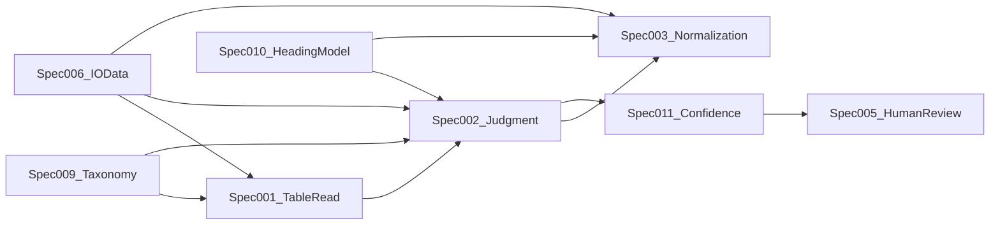

# 表解析コア仕様レビュー整理メモ（009/010/006 → 001/002/003）

## 全体サマリ

- 目的は、既存3本の価値を維持しつつ、責務境界と入力契約を固定して次の本文作成を迷いなく進めること。
- 対象は `SPEC-TI-009`（分類）、`SPEC-TI-010`（見出し）、`SPEC-TI-006`（I/O）を中心に、次に作る `SPEC-TI-001/002/003` への接続を明確化すること。
- 方針は「何を渡すかは 006、どう作るかは 001/002/003、閾値は 011、人確認遷移は 005」を厳守すること。

---

## 1. 既存3本のレビュー結果

### 1-1. SPEC-TI-009（表分類体系）

**責務**
- 表タイプ語彙の正本化（taxonomy_code）
- 分類境界と典型/非典型の定義
- 分類ごとの後続処理方針（読取/判定/正規化）

**既に定義できていること**
- 8分類、single-label既定、UNKNOWN運用の骨格
- 分類ごとの後続処理マトリクス

**不足**
- 分類確定に必要な最小証跡セット（根拠セル数、軸成立条件）
- UNKNOWN再試行条件と上限
- 複数表混在時の優先順位

**重複しやすい点**
- 002の判定条件と境界説明が重複しやすい
- 003の変換詳細まで踏み込むと責務逸脱

**曖昧だと困る点**
- `LIST_DETAIL / PIVOT_LIKE / FORM_REPORT` 境界が曖昧だと002と003の分岐が不安定になる

**後続3本へ渡す前提**
- 001: 分類別の読取重点（軸、集計行、ブロック分割）
- 002: taxonomy確定/保留の粒度
- 003: type別の正規化経路

### 1-2. SPEC-TI-010（見出しモデル）

**責務**
- HeadingTreeの論理表現
- 継承規則とcell_binding定義
- 欠落見出しのフォールバック方針

**既に定義できていること**
- row/column森林、node属性、row_path/column_path
- INCOMPLETE接続の考え方

**不足**
- `source_range` 座標規約（A1/R1C1/0-based）
- 欠落pathのシリアライズ規約（null/empty/flag）
- 疑似見出し判定入力を001からどう受けるか

**重複しやすい点**
- 見出しセル判定（002）と構造化（010）の混線
- 003の展開アルゴリズムに010が踏み込みすぎる

**曖昧だと困る点**
- 木構造表現が定まらないと002の証跡と003の展開が固定できない

**後続3本へ渡す前提**
- 001: merge・座標・書式メタの抽出要件
- 002: 候補見出し→確定見出しへの評価対象
- 003: bindingの必須フィールドとtrace粒度

### 1-3. SPEC-TI-006（入出力データ）

**責務**
- 論理エンティティと必須項目の単一参照源
- 列挙値と版管理の基準

**既に定義できていること**
- 10エンティティ（File〜JobRun）
- `decision` / `job status` 列挙
- Phase4での014/015投影方針

**不足**
- `TableCandidate` / `JudgmentResult` / `JobRun` の状態遷移表
- warning / reject / failed の粒度ルール
- `trace_map` 最小要件

**重複しやすい点**
- 014のDTO詳細、015の物理型を006に書いてしまうこと
- 001/002/003の処理ロジックを006に持ち込むこと

**曖昧だと困る点**
- 各仕様が独自JSONを定義して互換性が崩れる

**後続3本へ渡す前提**
- 001: `TableReadArtifact` 必須契約
- 002: `JudgmentResult` 語彙・必須項目
- 003: `NormalizedDataset` / `trace_map` 出力契約

---

## 2. 責務境界整理（固定ルール）

### 境界A: 009（分類） vs 010（見出し）
- 009に書く: 分類語彙、分類境界、分類別に期待する見出しパターン
- 010に書く: 見出し構造の表現、継承、binding
- 暫定ルール: 分類は「意味ラベル」、見出しは「構造モデル」

### 境界B: 010（見出し） vs 002（判定）
- 010に書く: 候補を木として表現する規約
- 002に書く: その候補を採用/棄却する判定条件
- 暫定ルール: 010 = how_to_represent、002 = whether_true

### 境界C: 009（分類） vs 003（正規化）
- 009に書く: typeごとの推奨経路
- 003に書く: 実変換アルゴリズム、例外、trace_map
- 暫定ルール: 009は分岐指示、003は変換実行

### 境界D: 006（I/O） vs 014/015（API/DB）
- 006に書く: 論理契約（概念名・必須項目・列挙）
- 014/015に書く: 通信/永続化の実装投影
- 暫定ルール: 014/015は006を上書きしない

### 境界E: 006（I/O） vs 001/002/003（処理）
- 006に書く: 入出力スキーマの最小共通契約
- 001/002/003に書く: 生成手順・判定条件・変換規則
- 暫定ルール: 何を渡すかは006、どう作るかは処理仕様

---

## 3. 後続3本への引き継ぎ事項

### A. 表読取仕様書（SPEC-TI-001）
- 009由来: 分類別読取重点（軸、集計、ブロック）
- 010由来: HeadingTree入力のための座標/merge/caption候補
- 006由来: `TableReadArtifact` 必須項目、`parse_warnings[]` 運用

### B. 判定ロジック仕様書（SPEC-TI-002）
- 009由来: taxonomy候補集合、境界ペア、UNKNOWN規則
- 010由来: 見出し候補採否、INCOMPLETE扱い
- 006由来: `JudgmentResult.decision/evidence[]` 契約

### C. 変換・正規化仕様書（SPEC-TI-003）
- 009由来: type別変換主経路
- 010由来: cell_binding / row_path / column_path
- 006由来: `NormalizedDataset.rows[]` と `trace_map`

---

## 4. 表解析コア仕様としての整合確認

**確認結果**
- 流れは自然（読取→判定→正規化）
- 重大な循環依存はない
- 重点重複リスクは「009と002」「010と003」
- 未定義で先に埋めるべき概念は次の3点:
  - classification evidence最小セット
  - heading座標規約
  - trace_map最小粒度

---

## 5. 次に作る3本の章立て案（本文着手レベル）

### 5-1. SPEC-TI-001 表読取仕様書

**文書目的**
- 入力ファイルから再現可能な `TableReadArtifact` を生成する

**スコープ**
- 抽出、領域分割、セル属性取得、読取失敗分類

**定義対象**
- 対応形式、候補検出、タイトル/注記/本体分離、merge/blank扱い

**参照前提**
- 009分類語彙、010入力要件、006 TableReadArtifact

**新たに決めること**
- 座標系、抽出優先順位、失敗時返却

**決めないこと**
- 最終分類確定、信頼度閾値、DB物理設計

**必須章**
1. 目的/スコープ
2. 入力形式と制約
3. 表候補検出規則
4. セル属性/結合/空白の扱い
5. 出力スキーマ（006対応）
6. 失敗とwarning
7. テスト観点

**推奨章**
- 性能上限、巨大ファイル対策、再処理再現性

**初版成立ライン**
- 対応形式、候補抽出規則、Artifact必須項目、失敗分類

**レビュー重点**
- 再現性、曖昧セル処理、複数表混在

### 5-2. SPEC-TI-002 判定ロジック仕様書

**文書目的**
- taxonomy/heading/row-type/column-meaningを判定し `decision` を確定する

**スコープ**
- 判定ルール、証跡、競合解決、要確認遷移

**定義対象**
- 表種別、見出し採否、集計/注記、属性/指標、時系列

**参照前提**
- 009分類境界、010構造、006 JudgmentResult

**新たに決めること**
- ルール優先順位、証跡形式、UNKNOWN条件

**決めないこと**
- UI文言、API設計、正規化実装手順

**必須章**
1. 判定対象一覧
2. 条件→結論→証跡テーブル
3. 競合解決ルール
4. decision遷移
5. 例外/要確認遷移
6. テスト観点

**推奨章**
- ルールID命名規約、将来ML導入境界

**初版成立ライン**
- 主要判定6種、decision三値、証跡項目

**レビュー重点**
- ルール衝突、境界ペア、再現性

### 5-3. SPEC-TI-003 変換・正規化仕様書

**文書目的**
- 判定済み表を分析可能な統一内部形式へ変換する

**スコープ**
- 縦持ち化、見出し展開、型正規化、trace保持

**定義対象**
- type別経路、集計/単位/欠損、trace_map

**参照前提**
- 009 type方針、010 cell_binding、006 NormalizedDataset

**新たに決めること**
- 変換アルゴリズム、非可逆要素、粒度

**決めないこと**
- 候補生成、UI表示、DB最適化

**必須章**
1. 入出力定義
2. type別変換フロー
3. 見出し展開規則
4. 型/文字正規化規則
5. trace_map規則
6. 例外処理
7. テスト観点

**推奨章**
- 可逆性評価、性能上限、サンプル変換集

**初版成立ライン**
- LIST_DETAIL/CROSSTABの2経路E2E例 + trace_map

**レビュー重点**
- 粒度整合、集計行扱い、欠損補完副作用

---

## 6. 推奨本文作成順

- 第1着手: `SPEC-TI-001`（002/003の入力形を固定するため）
- 次点: `SPEC-TI-002`（001のArtifact仮確定で着手可）
- その後: `SPEC-TI-003`（002の語彙確定後に本格化）

**並行可能条件**
- 001と002: 証跡項目セットが先に合意できれば部分並行可
- 003: 前半（型正規化章）は先行可、type別本体は002確定後

---

## 7. 今すぐ決めるべき論点

1. taxonomy境界ペア最終規則（LIST_DETAIL/PIVOT_LIKE/FORM_REPORT）
2. Heading座標規約（A1 or 0-based）と `source_range` 表記
3. `trace_map` 最小単位（セル単位 or 範囲単位）
4. UNKNOWN→人確認→再判定の再試行上限

---

## 8. 本文化へ進むためのGo条件

- 009: 境界ペアの暫定ルールが明文化済み
- 010: heading/path/source_range規約が固定済み
- 006: TableReadArtifact/JudgmentResult/NormalizedDataset必須項目が固定済み

上記を満たしたら `SPEC-TI-001` 本文化を開始し、`002` → `003` へ連結する。

---

## 次アクション

- 最初に本文化すべき1本: `SPEC-TI-001-table-read.md`
- 初版作成で注意すべき論点: 表候補検出の最小定義、Artifact再現性（同一入力で同一出力）
- 次の本文作成プロンプトで明示すべき制約:
  - 006の必須項目名を変更しない
  - 009/010の責務を侵食しない
  - decision閾値数値は002で確定しない（011参照）
