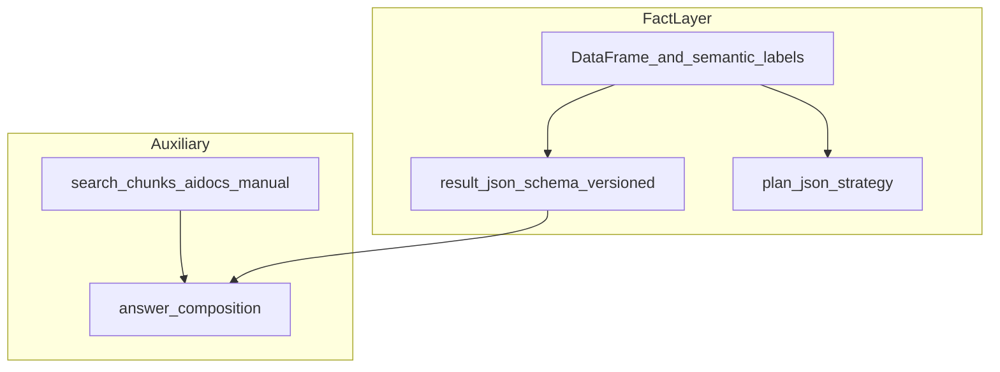

# 2026-04-14 — 分析ファクト層プロトタイプ（実行プラン）

## 概要

Excel / CSV 系の分析において、**LLM / RAG より先に「機械が根拠にできる事実」を正本化する**ための、**最小プロトタイプ**の実行プランである。  
実装の詳細アルゴリズムは本書の対象外とし、**何を正本とみなすか・どこで完了とみなすか**に限定する。

**意思決定の前提**（オーナー判断・個人開発・文書の扱い）: [次フェーズ設計整理（冒頭の前提メモ）](../00_管理/次フェーズ設計整理_004-006-013.md)

---

## 1. 目的

- 分析結果のうち、**再計算・検証可能な事実**を **単一の層（ファクト層）** として扱う。後続の RAG・生成はこの上に載せる。
- 永続化は既存の [`AnalysisRun`](../../backend/analysis_runs/models.py) の **`plan_json` / `result_json` / `evidence`** を用い、**追加 migration を前提にしない**スコープを第一候補とする。

---

## 2. 背景

[`execute_analysis`](../../backend/analysis_runs/services.py) は、DataFrame と意味ラベルから **`metrics`** を組み立て、併せて **`search_chunks`**（`source_types`: `manual` / `aidocs`）で補助文脈を取得し、LLM 応答に渡している。

**ファクト層**（集計・検出の確定結果）と **RAG 補助**（手順・用語・社内ドキュメント）を文書上で分離し、数値根拠の正本がどこにあるかをブレさせないことが本プランの意図である。

---

## 3. 最小プロトタイプの定義（完了条件）

### 3.1 正本の置き場

| 項目 | 役割 |
|------|------|
| **`result_json`** | 集計・検出の**本体**。単一の JSON オブジェクトとし、**版付きスキーマ**を含める（下記 `schema_version`）。 |
| **`plan_json`** | 戦略・使用列・意図（例: `query_intent`）など、**どう集計したかの説明**。ファクトの数値本体はここに置かない。 |
| **`answer` / `evidence.rag_items`** | **正本にしない**。生成・検索の補助結果として扱う。 |

### 3.2 必須メタ（最低限）

- **`schema_version`**: 例 `{ "analysis_facts": 1 }` のように、**後方互換の判断単位**が分かる形。
- **入力規模**: 例 `row_count`。
- **列対応**: 例 `detected_columns`（既存の `metrics.detected_columns` と整合）。
- **`query_intent`**: 既存の検出結果があればそのまま流用。

### 3.3 決定性

- 数値・ランキングは **同一 DataFrame・同一列解釈から再計算可能**なものに限定する。
- **推測・補完で埋めた数値**をファクト層に含めない。

### 3.4 検証（手動で可）

同一 **dataset**・同一 **question**・同一 **ヘッダ確定**で分析を **2 回**実行し、**`result_json` の構造と主要数値が一致する**こと（または差分が説明可能であること）。

---

## 4. 実装タスク（当たり先）

| 順 | 内容 |
|----|------|
| 1 | [`backend/analysis_runs/services.py`](../../backend/analysis_runs/services.py) の `execute_analysis` 戻り値および `run_analysis_to_completion` 経由の保存内容を、上記 **キー規約**に合わせる（`result_json` に `schema_version` を含める等）。 |
| 2 | 既存テスト（`backend/analysis_runs/` 配下があれば）に、**キー存在・決定性**の観点を追補する。 |
| 3 | 本段では **OpenAPI の確定**、**RAG への分析結果インデックス化**、**`table_intelligence` との本結線**、**migration 伴う契約変更**は行わない。 |

---

## 5. 成功条件チェックリスト

- [ ] **`result_json` がファクトの単一正本**であり、`schema_version` で版が分かる。
- [ ] **`plan_json` と `result_json` の責務**が混ざっていない（数値本体は `result_json`）。
- [ ] 同一条件の再実行で、**主要ファクトが再現**する（または差分が説明できる）。
- [ ] **`answer` / RAG 取得結果が正本として誤読されない**よう、コードまたはコメントで境界が分かる。
- [ ] **追加 migration なし**で進められた（本プランのスコープ内）。

---

## 6. 後続フェーズ（メモ・未確定）

以下は **将来の検討メモ**であり、確定仕様ではない。

| 段階 | 内容 |
|------|------|
| **後続 A** | 分析セッション要約の **短文チャンク**のみを RAG インデックス候補とする（**生セル全文**のベクトル化はしない）。 |
| **後続 B** | `AnalysisRun` / workspace 単位の **権限フィルタ**を RAG 検索に載せる。 |
| **後続 C** | **Embedding の更新・無効化**（データ再アップロード時など）のポリシー。 |
| **後続 D** | **`table_intelligence`（005 / 011 / 013）** は **別タスク**。ファクト層への **観測・抑制の反映**は、インタフェースが固まってから接続する。 |
| **後続 E** | 必要になった時点で **OpenAPI / 公開契約**を整理する（**non-breaking** 原則は TI 側メモと整合）。 |

---

## 7. コード変更との関係

- 本ファイルは **設計・実行プランの記録**として先に置ける。
- **アプリコードの変更**は別コミットとし、本ドキュメント単体のマージを妨げない運用を推奨する。
